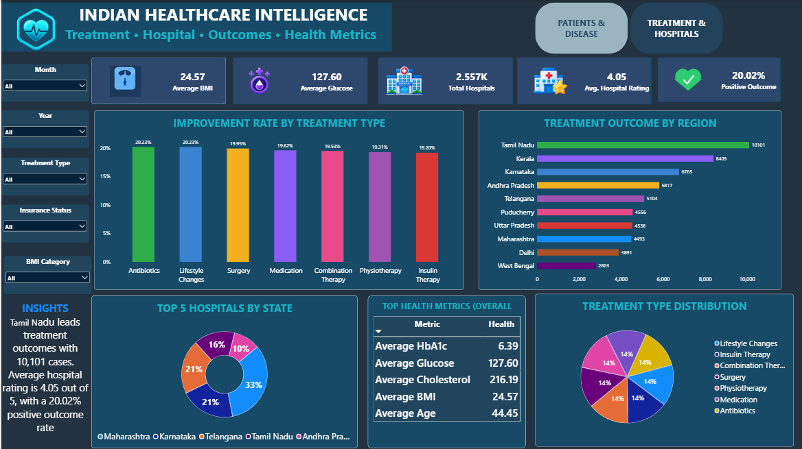
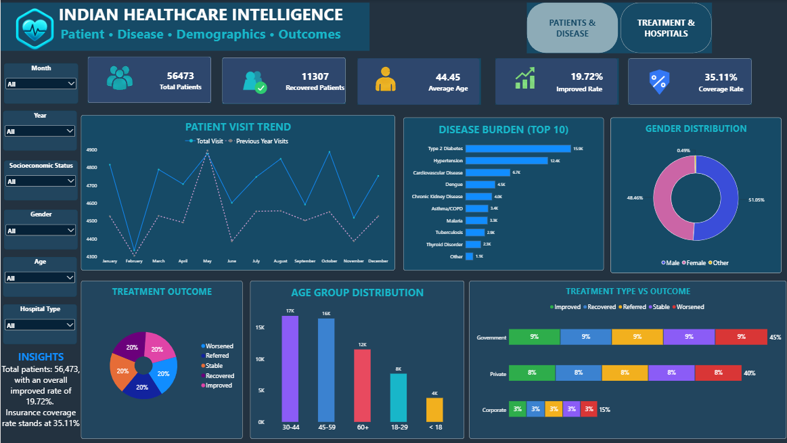

# Indian Healthcare Intelligence

### Patient • Disease • Treatment • Hospital Analytics

An end-to-end healthcare analytics project using **SQL, Microsoft Excel, Power BI, and DAX** to analyze patient demographics, disease burden, treatment outcomes, health metrics, insurance coverage, and hospital intelligence across India.

---

## 📊 Project Overview

Healthcare organizations generate large volumes of patient and hospital data. However, raw healthcare data is difficult to interpret without proper analysis and visualization.

This project transforms healthcare data into meaningful and interactive insights using:

- **SQL** for data analysis and business queries
- **Excel** for data cleaning and pivot-table analysis
- **Power BI** for interactive dashboards and visualization
- **DAX** for calculated measures and healthcare KPIs

The project focuses on understanding patient characteristics, disease patterns, treatment effectiveness, healthcare outcomes, insurance coverage, and hospital quality.

---

# 🎯 Project Objectives

The main objectives of this project are:

1. Analyze the overall patient population.
2. Understand patient demographics and age distribution.
3. Identify the most common diseases and diagnoses.
4. Analyze healthcare trends over time.
5. Compare treatment types and treatment outcomes.
6. Measure treatment improvement rates.
7. Analyze positive healthcare outcomes.
8. Evaluate insurance coverage.
9. Analyze government vs private hospital outcomes.
10. Analyze hospitals across Indian states and cities.
11. Compare hospital ratings and review volumes.
12. Build an interactive Power BI healthcare intelligence dashboard.

---

# 🗂️ Dataset

The project uses two main datasets.

### 1. Patient Healthcare Dataset

The patient dataset contains healthcare records covering areas such as:

- Patient ID
- Age
- Gender
- Region
- Visit Date
- Primary Diagnosis
- BMI
- Blood Glucose
- HbA1c
- Total Cholesterol
- Treatment Type
- Treatment Outcome
- Hospital Type
- Insurance Coverage
- Socioeconomic Status
- Occupation
- Imaging Type

### 2. Hospital Dataset

The hospital dataset contains hospital-level information including:

- Hospital ID
- City
- State
- District
- Hospital Density
- Latitude
- Longitude
- Hospital Rating
- Number of Reviews

---

# 🛠️ Tools & Technologies

| Tool | Purpose |
|---|---|
| **Microsoft Excel** | Data cleaning, pivot tables and exploratory analysis |
| **MySQL / SQL** | Data analysis and business queries |
| **Power BI** | Interactive dashboard and visualization |
| **DAX** | Calculated measures and KPIs |

---

# 🧹 Data Preparation

The healthcare data was prepared before visualization and analysis.

The preparation process included:

- Reviewing the dataset structure
- Checking record counts
- Checking duplicate Patient IDs
- Checking duplicate Hospital IDs
- Checking missing values
- Reviewing demographic fields
- Reviewing healthcare metrics
- Preparing data for Power BI
- Creating calculated measures using DAX

The SQL analysis includes checks for total patient records, unique patients, hospitals, duplicates, and missing values.

---

# 🧮 SQL Analysis

The SQL analysis covers multiple healthcare business areas.

## 1. Patient Analysis

Analysis includes:

- Total patient records
- Total unique patients
- Duplicate Patient IDs
- Patients by gender
- Average age by gender
- Age-group analysis
- Socioeconomic status
- Occupation analysis

---

## 2. Geographic Analysis

The project analyzes:

- Patients by region
- Region-wise patient counts
- Average age by region
- Top diagnosis in each region

This helps identify geographic differences in healthcare demand.

---

## 3. Disease Analysis

The disease analysis identifies:

- Most common diagnoses
- Diagnosis distribution
- Diagnosis by gender
- Average age by diagnosis
- Average BMI by diagnosis

This provides an overview of the major disease burden within the dataset.

---

## 4. Health Metrics Analysis

Key health metrics analyzed include:

- Average BMI
- Average Blood Glucose
- Average HbA1c
- Average Total Cholesterol

The analysis is performed both overall and by diagnosis.

---

## 5. Treatment Analysis

Treatment analysis covers:

- Treatment type distribution
- Treatment outcomes
- Treatment type vs treatment outcome
- Treatment improvement rate
- Positive outcome rate

The project defines positive outcomes as:

**Improved + Recovered**

---

## 6. Hospital Type Analysis

Hospital analysis includes:

- Government vs Private hospitals
- Hospital type distribution
- Hospital type vs treatment outcome
- Improvement rate by hospital type

This allows comparison of healthcare outcomes across hospital types.

---

## 7. Insurance Analysis

Insurance analysis includes:

- Insurance status
- Insurance coverage
- Insurance vs treatment outcome
- Insurance coverage percentage

---

## 8. Time Analysis

Healthcare activity is analyzed by:

- Year
- Month
- Year + Month
- Patient visit trends

This helps identify changes in healthcare utilization over time.

---

## 9. Hospital Dataset Analysis

Hospital-level analysis includes:

- Hospitals by state
- Hospitals by city
- Average hospital rating by state
- Average hospital density by state
- Top-rated hospitals
- Hospitals with highest review volume
- High-rated hospitals with significant review volume

---

# 📊 Power BI Dashboard

The Power BI report contains two main dashboard pages.

---

## 🏥 Page 1 — Patient Healthcare Overview

### Dashboard Focus

This page provides a high-level view of the patient population and healthcare burden.

### Key KPIs

- Total Patients
- Recovered Patients
- Average Age
- Improvement Rate
- Insurance Coverage Rate

### Visualizations

- Patient Visit Trend
- Disease Burden — Top 10
- Gender Distribution
- Treatment Outcome
- Age Group Distribution
- Treatment Type vs Outcome

### Main Questions Answered

- How many patients are represented in the dataset?
- What is the patient visit trend?
- Which diseases have the highest patient burden?
- What is the gender distribution?
- Which age groups have the highest number of patients?
- What proportion of patients improved?
- What proportion of patients recovered?
- How do treatment outcomes vary by hospital type?

### Dashboard Preview



---

# 🏥 Page 2 — Treatment & Hospital Intelligence

### Dashboard Focus

This page focuses on treatment effectiveness, healthcare outcomes, hospital performance, and health metrics.

### Key KPIs

- Average BMI
- Average Glucose
- Total Hospitals
- Average Hospital Rating
- Positive Outcome Rate

### Visualizations

- Improvement Rate by Treatment Type
- Treatment Outcome by Region
- Top 5 Hospitals by State
- Top Health Metrics Overall
- Treatment Type Distribution

### Main Questions Answered

- Which treatment types have higher improvement rates?
- How do treatment outcomes vary by region?
- Which states have highly rated hospitals?
- What are the overall health metrics?
- How are treatment types distributed?
- What is the overall positive outcome rate?

### Dashboard Preview



---

# 📌 Key Healthcare KPIs

The Power BI dashboard uses calculated DAX measures to create healthcare KPIs.

### Total Patients

Measures the number of unique patients.

### Improved Patients

Counts patients whose treatment outcome is:

**Improved**

### Improvement Rate

Measures the percentage of patients with an **Improved** treatment outcome.

### Recovered Patients

Counts patients whose treatment outcome is:

**Recovered**

### Positive Outcome Rate

Measures:

**Improved + Recovered**

as a percentage of the patient population.

### Average Age

Calculates the average patient age.

### Average BMI

Calculates the average BMI.

### Average Glucose

Calculates the average blood glucose level.

### Average HbA1c

Calculates the average HbA1c level.

### Average Cholesterol

Calculates the average total cholesterol level.

### Insurance Coverage Rate

Measures the proportion of patients covered by insurance.

### Total Hospitals

Counts hospitals in the hospital dataset.

### Average Hospital Rating

Calculates the average hospital rating.

### Total Reviews

Calculates the total number of hospital reviews.

---

# 🔍 Advanced SQL Analysis

The project also includes advanced SQL techniques such as:

- Common Table Expressions (CTEs)
- Window functions
- `RANK()`
- Aggregations
- Conditional aggregation
- Subqueries
- `GROUP BY`
- `HAVING`
- `ORDER BY`

### Example Advanced Analysis

The SQL project identifies the:

**Top 3 regions by patient count**

and the:

**Top diagnosis in each region**

using ranking and window functions.

---

# 💡 Business Insights

The analysis can be used to understand:

### Patient Demographics

Patient distribution varies across gender and age groups, helping identify the major demographic segments represented in the healthcare dataset.

### Disease Burden

The disease analysis highlights the diagnoses with the largest patient populations and provides a basis for understanding healthcare demand.

### Treatment Effectiveness

Improvement rates across treatment types can be compared to identify treatments associated with stronger observed outcomes within the dataset.

### Healthcare Outcomes

Combining **Improved** and **Recovered** patients provides a broader view of positive treatment outcomes.

### Hospital Intelligence

Hospital ratings, review volumes, density, state and city information provide multiple dimensions for evaluating hospital presence and perceived quality.

### Insurance

Insurance coverage analysis helps understand the proportion of patients covered and enables comparison of outcomes across insurance-related categories.

---

# 📁 Project Structure

```text
india-healthcare-analytics/
│
├── Healthcare_Project_Dashboard.pbix
│
├── Healthcare_project_Cleaneddata.xlsx
│
├── Patient_Healthcare_Overview.png
│
├── README.md
│
├── Treatment_Hospital_Intelligence.png
│
└── healthcare project analysis.sql
